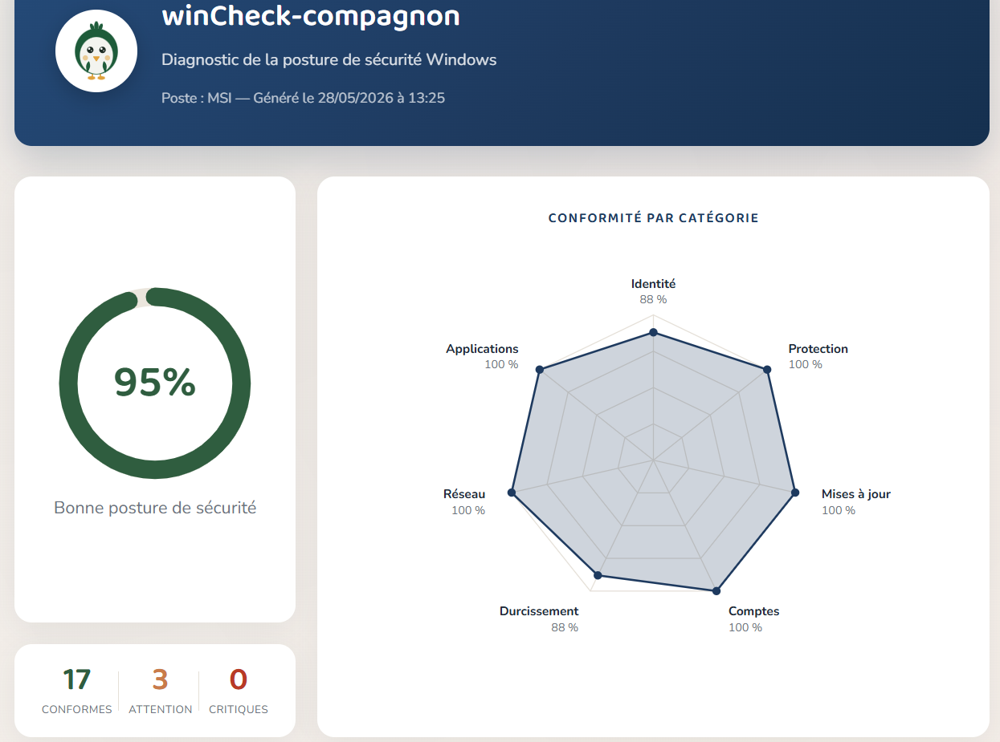

# winCheck-compagnon

**Diagnostic de la posture de sécurité de votre poste Windows — en un clic, en local, sans rien installer.**

winCheck-compagnon est un script PowerShell qui vérifie une vingtaine de points de sécurité essentiels de Windows, attribue un score global, et génère un **rapport HTML clair et pédagogique** que tout le monde peut comprendre — pas seulement les experts.

## Ce qu'il vérifie

winCheck-compagnon passe en revue plusieurs familles de contrôles :

- **Identité du poste** — Secure Boot, chiffrement BitLocker, contrôle de compte d'utilisateur (UAC), puce TPM
- **Protection** — antivirus temps réel, pare-feu, âge des signatures, protection anti-falsification, SmartScreen, protection contre les applications indésirables
- **Mises à jour** — ancienneté de la dernière mise à jour Windows installée
- **Comptes** — nombre d'administrateurs locaux, état du compte Invité
- **Durcissement** — protocole SMBv1, LLMNR, stockage des mots de passe WDigest
- **Réseau** — Bureau à distance (RDP), partages réseau exposés
- **Surveillance** — ports en écoute, connexions actives, processus s'exécutant depuis des emplacements inhabituels (à titre informatif)
- **Applications interdites** — détection des logiciels proscrits sur un poste professionnel : accès distant non maîtrisé, P2P/torrent, jeux, minage, stockage cloud personnel, messageries non autorisées, VPN de contournement, cracks
- **Persistance** — programmes lancés au démarrage et tâches planifiées (à titre informatif)

Le rapport propose en plus un **sommaire de navigation** pour parcourir facilement toutes les sections.

Chaque point est expliqué : ce qui est vérifié, le risque associé, et la marche à suivre pour corriger.

## Confidentialité

winCheck-compagnon s'exécute **entièrement sur votre machine**. Aucune donnée n'est collectée, transmise ou envoyée vers Internet. Le rapport est généré localement, à côté du script, et n'appartient qu'à vous.

## Prérequis

- Windows 10 ou Windows 11
- PowerShell 5.1 ou supérieur (inclus dans Windows)
- Droits administrateur (le script les demande automatiquement)

## Utilisation

1. Téléchargez le projet (bouton vert **Code → Download ZIP**), puis décompressez-le.
2. Ouvrez le dossier, faites un **clic droit** sur `winCheck.ps1` → **Exécuter avec PowerShell**.
3. Acceptez la demande d'élévation (le diagnostic nécessite les droits administrateur).
4. À la fin, le rapport `rapport.html` s'ouvre automatiquement dans votre navigateur.

> Si l'exécution est bloquée, ouvrez PowerShell en administrateur et lancez :
> `Set-ExecutionPolicy -Scope CurrentUser RemoteSigned`

## Le rapport

Le rapport présente votre **score global**, un **graphique radar** de la conformité par catégorie, et le détail de chaque contrôle avec un code couleur (conforme / à améliorer / critique). Les points à corriger sont accompagnés d'explications concrètes.

## Famille « Outils Compagnon »

winCheck-compagnon fait partie des **Outils Compagnon**, une famille d'outils de cybersécurité pensés pour être accessibles à tous, reconnaissables à leur petite mascotte. Découvrez aussi [browsercheck-compagnon](https://github.com/Yeni-raamia/browsercheck-compagnon), qui sécurise votre navigateur.

## Licence

Distribué sous licence MIT. Voir le fichier [LICENSE](LICENSE).

## Auteur

**DOUKAKAS Yeni**